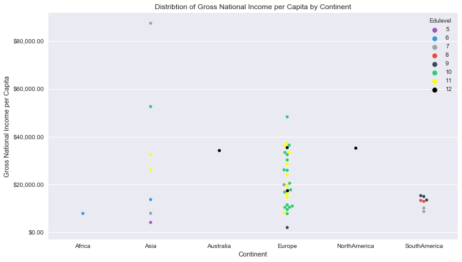

```python
import pandas as pd
```

Reading data from excel


```python
undata_HDI=pd.read_excel("UNdata.xlsx",sheetname=0)
```


```python
undata_cont=pd.read_excel("UNdata.xlsx", sheetname=5)
```

Merging data from HDI sheet and cont sheet


```python
undata_final=pd.merge(undata_HDI,undata_cont,left_on=undata_HDI.iloc[:,0],right_on=undata_cont.iloc[:,0],how='inner')
```

Exploring data types to see is any variable has a wrong data type


```python
undata_final.dtypes
```


    country          object
    HDI             float64
    LifeExp         float64
    Edu             float64
    GNI_PC            int64
    HDI_NI          float64
    Country Name     object
    CONTINENT        object
    dtype: object


Changing data types as needed


```python
undata_final.GNI_PC=undata_final.GNI_PC.astype('float64')
```


```python
undata_final.country=undata_final.country.astype('category')
```


```python
undata_final.CONTINENT=undata_final.CONTINENT.astype('category')
```


```python
undata_final.dtypes
```


    country         category
    HDI              float64
    LifeExp          float64
    Edu              float64
    GNI_PC           float64
    HDI_NI           float64
    Country Name      object
    CONTINENT       category
    dtype: object


Adding a new column 'Edulevel' which signifies Education level


```python
undata_final['Edulevel']=undata_final['Edu'].astype('int64')
```


```python
undata_final.dtypes
```


    country         category
    HDI              float64
    LifeExp          float64
    Edu              float64
    GNI_PC           float64
    HDI_NI           float64
    Country Name      object
    CONTINENT       category
    Edulevel           int64
    dtype: object


```python
%matplotlib inline
```


```python
import seaborn as sns
```


```python
import numpy as np
```


```python
undata_final.head()
```


<div>
<style>
    .dataframe thead tr:only-child th {
        text-align: right;
    }

    .dataframe thead th {
        text-align: left;
    }

    .dataframe tbody tr th {
        vertical-align: top;
    }
</style>
<table border="1" class="dataframe">
  <thead>
    <tr style="text-align: right;">
      <th></th>
      <th>country</th>
      <th>HDI</th>
      <th>LifeExp</th>
      <th>Edu</th>
      <th>GNI_PC</th>
      <th>HDI_NI</th>
      <th>Country Name</th>
      <th>CONTINENT</th>
      <th>Edulevel</th>
    </tr>
  </thead>
  <tbody>
    <tr>
      <th>0</th>
      <td>Australia</td>
      <td>0.938</td>
      <td>82.0</td>
      <td>12.0</td>
      <td>34340.0</td>
      <td>0.978</td>
      <td>Australia</td>
      <td>Australia</td>
      <td>12</td>
    </tr>
    <tr>
      <th>1</th>
      <td>Netherlands</td>
      <td>0.921</td>
      <td>80.8</td>
      <td>11.6</td>
      <td>37282.0</td>
      <td>0.945</td>
      <td>Netherlands</td>
      <td>Europe</td>
      <td>11</td>
    </tr>
    <tr>
      <th>2</th>
      <td>Germany</td>
      <td>0.920</td>
      <td>80.6</td>
      <td>12.2</td>
      <td>35431.0</td>
      <td>0.948</td>
      <td>Germany</td>
      <td>Europe</td>
      <td>12</td>
    </tr>
    <tr>
      <th>3</th>
      <td>Ireland</td>
      <td>0.916</td>
      <td>80.7</td>
      <td>11.6</td>
      <td>28671.0</td>
      <td>0.960</td>
      <td>Ireland</td>
      <td>Europe</td>
      <td>11</td>
    </tr>
    <tr>
      <th>4</th>
      <td>Sweden</td>
      <td>0.916</td>
      <td>81.6</td>
      <td>11.7</td>
      <td>36143.0</td>
      <td>0.940</td>
      <td>Sweden</td>
      <td>Europe</td>
      <td>11</td>
    </tr>
  </tbody>
</table>
</div>


```python
import matplotlib.pyplot as plt
import matplotlib.ticker as mtick


fig = plt.figure(1)
fig.set_figheight(15)
fig.set_figwidth(12)

ax = fig.add_subplot(2,1,1)

format = '${x:,.2f}'
tick = mtick.StrMethodFormatter(format)
ax.yaxis.set_major_formatter(tick) 


colors = ["#9b59b6", "#3498db", "#95a5a6", "#e74c3c", "#34495e", "#2ecc71","#ffff00","#000000"]
a=sns.swarmplot(x='CONTINENT', y='GNI_PC',hue='Edulevel', data=undata_final.iloc[:,[4,7,8]],palette=colors,ax=ax)
a.set(xlabel='Continent',ylabel='Gross National Income per Capita')
a.set_title("Distribtion of Gross National Income per Capita by Continent")

fig.show
```


    <bound method Figure.show of <matplotlib.figure.Figure object at 0x000000951CF274E0>>





```python

```


```python

```
